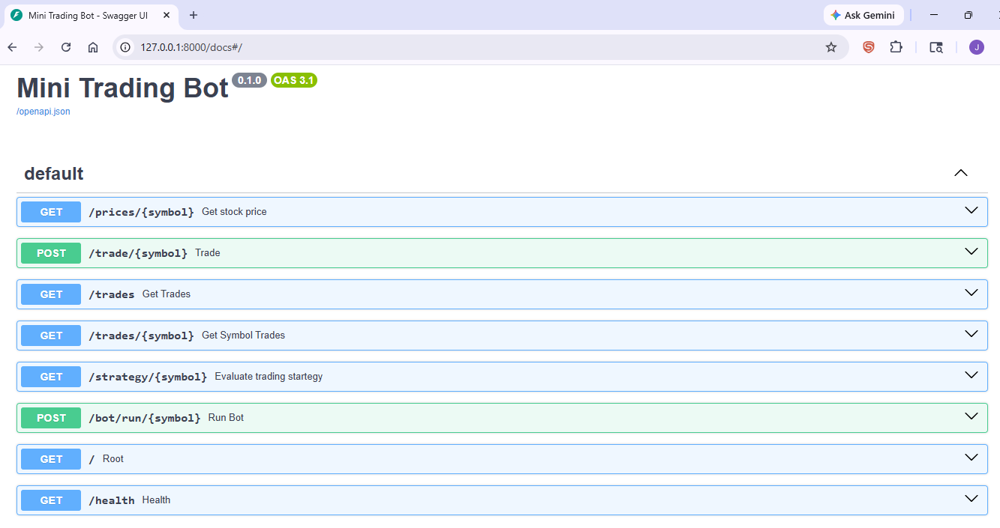
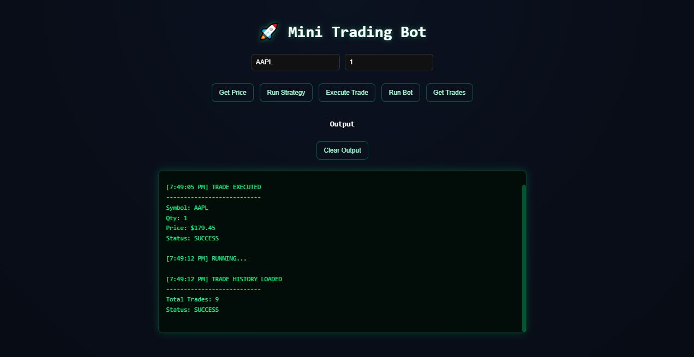
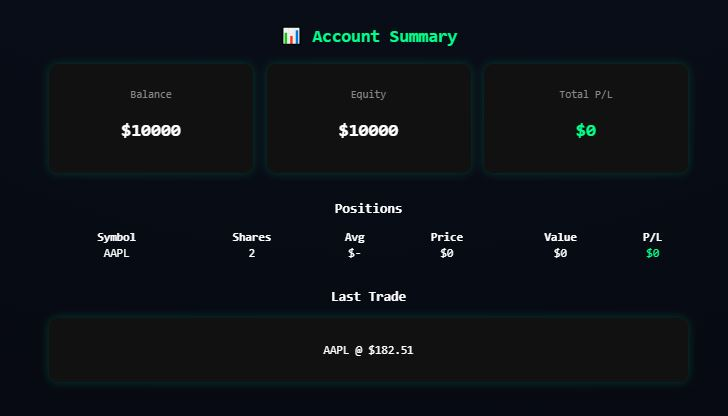
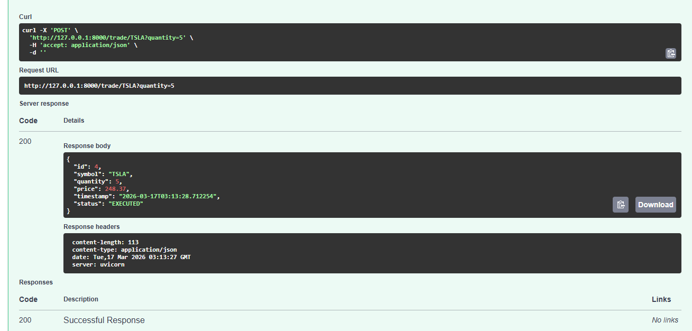

# 🚀 Mini Trading Bot API

A backend trading simulation project built with FastAPI and PostgreSQL as part of my software development learning.

This project focuses on practicing core backend concepts including:
- API development with FastAPI
- Service-layer design for business logic
- Database integration with PostgreSQL
- Basic trading strategy evaluation (BUY / SELL / HOLD)
- Simulated trade execution and persistence
---

## 📌 Features

- 📈 Simulated market price generation
- 🧠 Strategy engine (BUY / SELL / HOLD)
- 💰 Trade execution system
- 🗄️ Persistent trade storage (PostgreSQL)
- 🔍 Query trades by symbol or retrieve all trades
- ⚡ FastAPI with automatic Swagger docs
- ❤️ Health check endpoint

---

## 📸 Screenshots

### 🧠 Swagger API Documentation


---

### 💻 Main Trading UI


---

### 📊 Account Summary Dashboard


---

### 💰 Trade Execution Example


---
## 🏗️ Architecture Flow

This diagram shows how requests move through the system from client → API → services → database.

```mermaid
flowchart TD
    A[Client Request] --> B[FastAPI Router]

    B --> C[Strategy Service]
    B --> D[Trade Service]

    C --> E[Market Price Service]
    D --> F[PostgreSQL Database]
